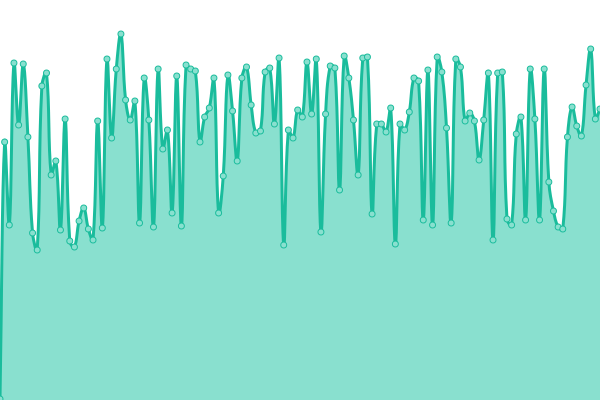
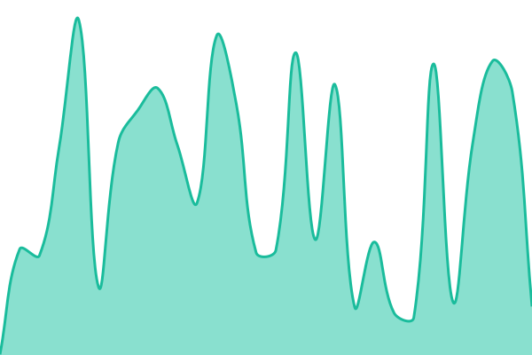
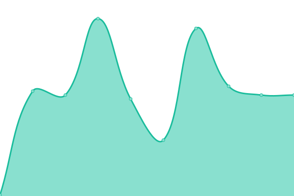

# [📈 Live Status](https://atatkin.github.io/milos-uptime): <!--live status--> **🟥 Complete outage**

This repository contains the open-source uptime monitor and status page for [atatkin](https://atatkin.github.io/milos-uptime), powered by [Upptime](https://github.com/upptime/upptime).

With [Upptime](https://upptime.js.org), you can get your own unlimited and free uptime monitor and status page, powered entirely by a GitHub repository. We use [Issues](https://github.com/atatkin/milos-uptime/issues) as incident reports, [Actions](https://github.com/atatkin/milos-uptime/actions) as uptime monitors, and [Pages](https://atatkin.github.io/milos-uptime) for the status page.

<!--start: status pages-->
<!-- This summary is generated by Upptime (https://github.com/upptime/upptime) -->
<!-- Do not edit this manually, your changes will be overwritten -->
<!-- prettier-ignore -->
| URL | Status | History | Response Time | Uptime |
| --- | ------ | ------- | ------------- | ------ |
|  Wedding HTTP | 🟥 Down | [wedding-http.yml](https://github.com/atatkin/milos-uptime/commits/HEAD/history/wedding-http.yml) | 

 0ms
     
 | 

<a href="https://atatkin.github.io/milos-uptime/history/wedding-http">0.00%</a>
    

|  Wedding HTTPS | 🟥 Down | [wedding-https.yml](https://github.com/atatkin/milos-uptime/commits/HEAD/history/wedding-https.yml) | 

 0ms
     
 | 

<a href="https://atatkin.github.io/milos-uptime/history/wedding-https">0.00%</a>
    

|  Minted HTTP | 🟥 Down | [minted-http.yml](https://github.com/atatkin/milos-uptime/commits/HEAD/history/minted-http.yml) | 

 299ms
     
 | 

<a href="https://atatkin.github.io/milos-uptime/history/minted-http">18.12%</a>
    

|  Minted HTTPS | 🟥 Down | [minted-https.yml](https://github.com/atatkin/milos-uptime/commits/HEAD/history/minted-https.yml) | 

 236ms
     
 | 

<a href="https://atatkin.github.io/milos-uptime/history/minted-https">18.56%</a>
    

<!--end: status pages-->

[**Visit our status website →**](https://atatkin.github.io/milos-uptime)

## 📄 License

- Powered by: [Upptime](https://github.com/upptime/upptime)
- Code: [MIT](./LICENSE) © [atatkin](https://atatkin.github.io/milos-uptime)
- Data in the `./history` directory: [Open Database License](https://opendatacommons.org/licenses/odbl/1-0/)
